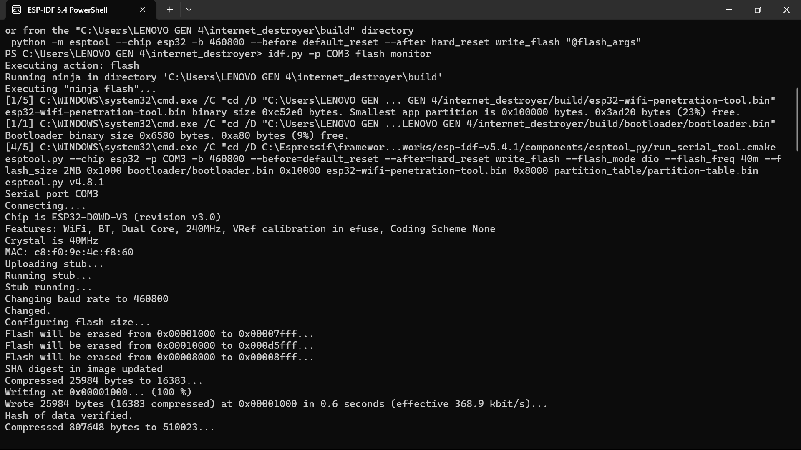

# ESP32 WiFi Penetration Tool

This project demonstrates the setup and execution of a WiFi penetration testing tool using the ESP32 microcontroller. The tool is capable of performing several types of WiFi-based attacks such as deauthentication (DoS), PMKID capture, and WPA handshake capture. The objective was to gain hands-on experience in embedded systems, network protocol manipulation, and troubleshooting real-world firmware projects.

WiFi penetration tools are widely used in cybersecurity for testing network robustness. By running this project, we simulate real-world attack scenarios in a safe and controlled environment, enhancing both theoretical and practical understanding of wireless vulnerabilities.

---

## Tools & Requirements

### Hardware
- ESP32-WROOM-32 Development Board
- USB to Micro-USB cable

### Software
- ESP-IDF v5.4.1
- Python 3.11
- Windows 10
- Serial Terminal / IDF Monitor

### Libraries / Frameworks
- esptool.py
- lwIP (for `ntohs()` and related functions)
- ESP-IDF components (esp_wifi, esp_event, etc.)

---

## Project Setup

The source code for this project was downloaded from the GitHub repository [`ereedsanchez/internet_destroyer`](https://github.com/ereedsanchez/internet_destroyer). After extracting the archive, the project was opened using the ESP-IDF PowerShell environment.

### Basic Setup Steps
- Deleted the pre-existing `build/` folder to avoid cross-environment conflicts
- Ran `idf.py set-target esp32`
- Configured serial settings via `idf.py menuconfig`
- Built the project using `idf.py build`

**Screenshot 1:** ESP-IDF environment open with project directory loaded  

**Screenshot 2:** Output of `idf.py build` showing successful compilation

---

## Troubleshooting & Debugging

During the initial build attempt, the following errors were encountered:
- `esp_wifi_types.h: No such file or directory`
- `esp_event.h: No such file or directory`
- `ntohs` implicit declaration error

### Fixes Applied
- Added `REQUIRES esp_wifi` and `esp_event` in appropriate `CMakeLists.txt` files
- Included `<lwip/inet.h>` in `hccapx_serializer.c` to resolve `ntohs` issues
- Used `idf.py fullclean` before each rebuild to clear cached configurations

All errors were successfully resolved, leading to a successful firmware build.

---

## Execution & Testing

Once the firmware was flashed using `idf.py -p COM3 flash monitor`, the ESP32 booted successfully. It initialized in STA + SoftAP mode and created a network named `ManagementAP`.

**Screenshot 3:** Terminal output showing successful boot and monitor logs  

**Screenshot 4:** Phone connected to ManagementAP WiFi network  

**Screenshot 5:** Browser accessing `http://192.168.4.1` on mobile device (if web interface is present)

---

## Results

- **Deauth (DoS) Attack:** Successfully executed
- Devices were disconnected from their WiFi networks
- ESP32 entered the attack loop and sent disassociation frames continuously
- Behavior confirmed via log outputs and target device response

**Screenshot 6:** Terminal output showing logs of the DoS attack in progress
  
**Screenshot 7:** Web interface showing attack options and status

---

## Conclusion

This project was a successful implementation of a WiFi penetration testing framework on an ESP32 microcontroller. From resolving low-level compilation errors to confirming a live deauthentication attack, the experience covered both firmware engineering and practical network manipulation.

### Lessons Learned
- CMake dependency management is crucial in ESP-IDF
- Network attacks require ethical caution and controlled environments
- Serial logs are essential for real-time feedback and troubleshooting

### Next Steps
- Enable PMKID or handshake capture mode
- Add web interface controls via HTTP server
- Export captured credentials to SD card or SPIFFS

---

## References

- [ESP-IDF Official Documentation](https://docs.espressif.com/projects/esp-idf/en/latest/esp32/)
- [ESP32 Internet Destroyer GitHub Repository](https://github.com/ereedsanchez/internet_destroyer)
- Espressif Forum and Stack Overflow discussions